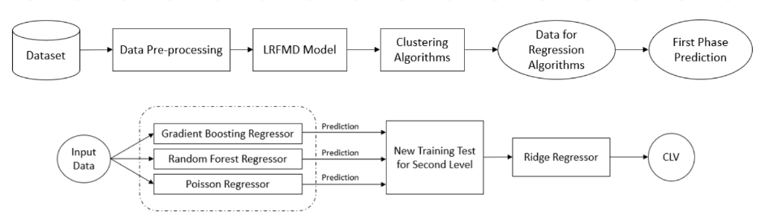

# RFM-Stacked-Ensemble-CLV-Prediction
A hybrid RFM-based framework for Customer Lifetime Value (CLV) prediction using K-means clustering and stacked ensemble learning in the FMCG industry.

Here is the model diagram:

